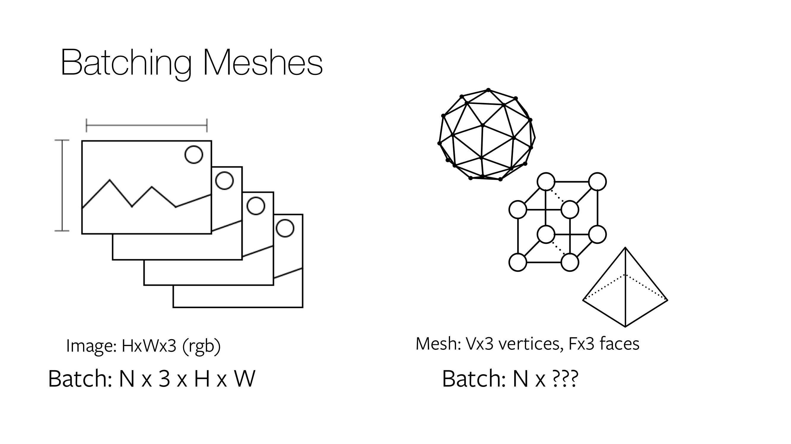

# Batching

In deep learning, every optimization step operates on multiple input examples for robust training. Thus, efficient batching is crucial. For image inputs, batching is straightforward; N images are resized to the same height and width and stacked as a 4 dimensional tensor of shape `N x 3 x H x W`. For meshes, batching is less straightforward.

## Batch modes for meshes

Assume you want to construct a batch containing two meshes, with `mesh1 = (v1: V1 x 3, f1: F1 x 3)` containing `V1` vertices and `F1` faces, and `mesh2 = (v2: V2 x 3, f2: F2 x 3)` with `V2 (!= V1)` vertices and `F2 (!= F1)` faces. The [Meshes][meshes] data structure provides three different ways to batch *heterogeneous* meshes. If `meshes = Meshes(verts = [v1, v2], faces = [f1, f2])` is an instantiation of the data structure, then

* List: Returns the examples in the batch as a list of tensors. Specifically, `meshes.verts_list()` returns the list of vertices `[v1, v2]`. Similarly, `meshes.faces_list()` returns the list of faces `[f1, f2]`.
* Padded: The padded representation constructs a tensor by padding the extra values. Specifically, `meshes.verts_padded()` returns a tensor of shape `2 x max(V1, V2) x 3` and pads the extra vertices with `0`s. Similarly, `meshes.faces_padded()` returns a tensor of shape `2 x max(F1, F2) x 3` and pads the extra faces with `-1`s.
* Packed: The packed representation concatenates the examples in the batch into a tensor. In particular, `meshes.verts_packed()` returns a tensor of shape `(V1 + V2) x 3`. Similarly, `meshes.faces_packed()` returns a tensor of shape `(F1 + F2) x 3` for the faces. In the packed mode, auxiliary variables are computed that enable efficient conversion between packed and padded or list modes.

## Use cases for batch modes

The need for different mesh batch modes is inherent to the way PyTorch operators are implemented. To fully utilize the optimized PyTorch ops, the [Meshes][meshes] data structure allows for efficient conversion between the different batch modes. This is crucial when aiming for a fast and efficient training cycle. An example of this is [Mesh R-CNN][meshrcnn]. Here, in the same forward pass different parts of the network assume different inputs, which are computed by converting between the different batch modes. In particular, [vert_align][vert_align] assumes a *padded* input tensor while immediately after [graph_conv][graphconv] assumes a *packed* input tensor.

[meshes]: https://github.com/facebookresearch/pytorch3d/blob/main/pytorch3d/structures/meshes.py
[graphconv]: https://github.com/facebookresearch/pytorch3d/blob/main/pytorch3d/ops/graph_conv.py
[vert_align]: https://github.com/facebookresearch/pytorch3d/blob/main/pytorch3d/ops/vert_align.py
[meshrcnn]: https://github.com/facebookresearch/meshrcnn
