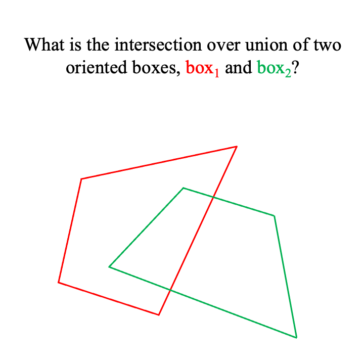

# Intersection Over Union of Oriented 3D Boxes: A New Algorithm

Author: Georgia Gkioxari

Implementation: Georgia Gkioxari and Nikhila Ravi

## Description

Intersection over union (IoU) of boxes is widely used as an evaluation metric in object detection ([1][pascalvoc], [2][coco]).
In 2D, IoU is commonly applied to axis-aligned boxes, namely boxes with edges parallel to the image axis.
In 3D, boxes are usually not axis aligned and can be oriented in any way in the world.
We introduce a new algorithm which computes the *exact* IoU of two *oriented 3D boxes*.

Our algorithm is based on the simple observation that the intersection of two oriented 3D boxes, `box1` and `box2`, is a convex polyhedron (convex n-gon in 2D) with `n > 2` comprised of connected *planar units*.
In 3D, these planar units are 3D triangular faces.
In 2D, they are 2D edges.
Each planar unit belongs strictly to either `box1` or `box2`.
Our algorithm finds these units by iterating through the sides of each box.

1. For each 3D triangular face `e` in `box1` we check wether `e` is *inside* `box2`.
2. If `e` is not *inside*, then we discard it.
3. If `e` is *inside* or *partially inside*, then the part of `e` *inside* `box2` is added to the units that comprise the final intersection shape.
4. We repeat for `box2`.

Below, we show a visualization of our algorithm for the case of 2D oriented boxes.

<p align="center">

</p>

Note that when a box's unit `e` is *partially inside* a `box` then `e` breaks into smaller units. In 2D, `e` is an edge and breaks into smaller edges. In 3D, `e` is a 3D triangular face and is clipped to more and smaller faces by the plane of the `box` it intersects with.
This is the sole fundamental difference between the algorithms for 2D and 3D.

## Comparison With Other Algorithms

Current algorithms for 3D box IoU rely on crude approximations or make box assumptions, for example they restrict the orientation of the 3D boxes.
[Objectron][objectron] provides a nice discussion on the limitations of prior works.
[Objectron][objectron] introduces a great algorithm for exact IoU computation of oriented 3D boxes.
Objectron's algorithm computes the intersection points of two boxes using the [Sutherland-Hodgman algorithm][clipalgo].
The intersection shape is formed by the convex hull from the intersection points, using the [Qhull library][qhull].

Our algorithm has several advantages over Objectron's:

* Our algorithm also computes the points of intersection, similar to Objectron, but in addition stores the *planar units* the points belong to. This eliminates the need for convex hull computation which is `O(nlogn)` and relies on a third party library which often crashes with nondescript error messages.
* Objectron's implementation assumes that boxes are a rotation away from axis aligned. Our algorithm and implementation make no such assumption and work for any 3D boxes.
* Our implementation supports batching, unlike Objectron which assumes single element inputs for `box1` and `box2`.
* Our implementation is easily parallelizable and in fact we provide a custom C++/CUDA implementation which is **450 times faster than Objectron**.

Below we compare the performance for Objectron (in C++) and our algorithm, in C++ and CUDA. We benchmark for a common use case in object detection where `boxes1` hold M predictions and `boxes2` hold N ground truth 3D boxes in an image and compute the `MxN` IoU matrix. We report the time in ms for `M=N=16`.

<p align="center">

</p>

## Usage and Code

```python
from pytorch3d.ops import box3d_overlap
# Assume inputs: boxes1 (M, 8, 3) and boxes2 (N, 8, 3)
intersection_vol, iou_3d = box3d_overlap(boxes1, boxes2)
```

For more details, read [iou_box3d.py](https://github.com/facebookresearch/pytorch3d/blob/main/pytorch3d/ops/iou_box3d.py).

Note that our implementation is not differentiable as of now. We plan to add gradient support soon.

We also include have extensive [tests](https://github.com/facebookresearch/pytorch3d/blob/main/tests/test_iou_box3d.py) comparing our implementation with Objectron and MeshLab.


## Cite

If you use our 3D IoU algorithm, please cite PyTorch3D

```bibtex
@article{ravi2020pytorch3d,
    author = {Nikhila Ravi and Jeremy Reizenstein and David Novotny and Taylor Gordon
                  and Wan-Yen Lo and Justin Johnson and Georgia Gkioxari},
    title = {Accelerating 3D Deep Learning with PyTorch3D},
    journal = {arXiv:2007.08501},
    year = {2020},
}
```

[pascalvoc]: http://host.robots.ox.ac.uk/pascal/VOC/
[coco]: https://cocodataset.org/
[objectron]: https://arxiv.org/abs/2012.09988
[qhull]: http://www.qhull.org/
[clipalgo]: https://en.wikipedia.org/wiki/Sutherland%E2%80%93Hodgman_algorithm
