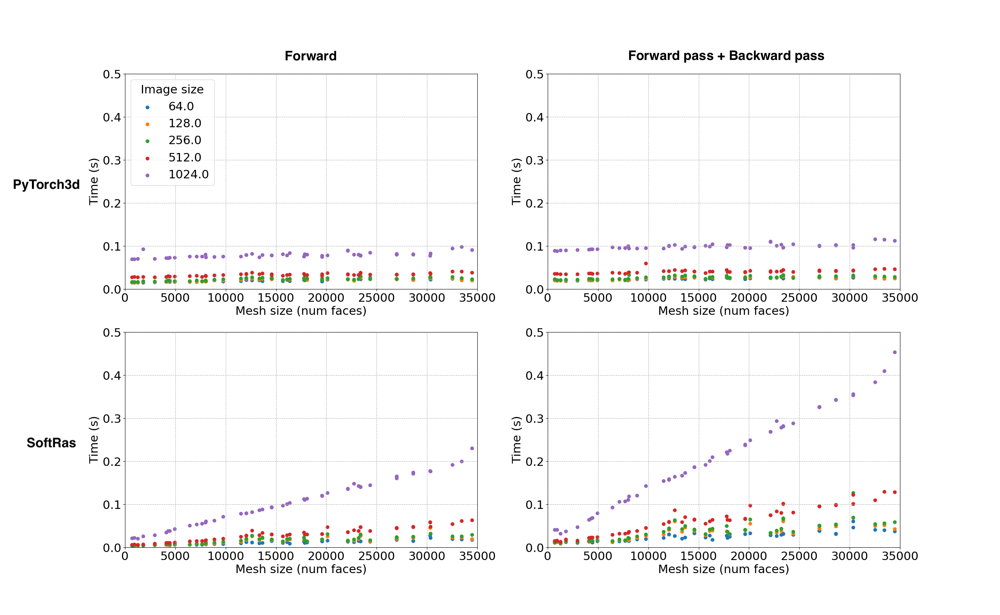

# Rendering Overview

Differentiable rendering is a relatively new and exciting research area in computer vision, bridging the gap between 2D and 3D by allowing 2D image pixels to be related back to 3D properties of a scene.

For example, by rendering an image from a 3D shape predicted by a neural network, it is possible to compute a 2D loss with a reference image. Inverting the rendering step means we can relate the 2D loss from the pixels back to the 3D properties of the shape such as the positions of mesh vertices, enabling 3D shapes to be learnt without any explicit 3D supervision.

We extensively researched existing codebases for differentiable rendering and found that:
- the rendering pipeline is complex with more than 7 separate components which need to interoperate and be differentiable
- popular existing approaches [[1](#1), [2](#2)] are based on the same core implementation which bundles many of the key components into large CUDA kernels which require significant expertise to understand, and has limited scope for extensions  
- existing methods either do not support batching or assume that meshes in a batch have the same number of vertices and faces
- existing projects only provide CUDA implementations so they cannot be used without GPUs

In order to experiment with different approaches, we wanted a modular implementation that is easy to use and extend, and supports [heterogeneous batching](batching.md).

Taking inspiration from existing work [[1](#1), [2](#2)], we have created a new, modular, differentiable renderer with **parallel implementations in PyTorch, C++ and CUDA**, as well as comprehensive documentation and tests, with the aim of helping to further research in this field.

Our implementation decouples the rasterization and shading steps of rendering. The core rasterization step (based on [[2]](#2)) returns several intermediate variables and has an optimized implementation in CUDA. The rest of the pipeline is implemented purely in PyTorch, and is designed to be customized and extended. With this approach, the PyTorch3D differentiable renderer can be imported as a library.

## <u>Get started</u>

To learn about more the implementation and start using the renderer refer to [renderer_getting_started.md](renderer_getting_started.md), which also contains the [architecture overview](assets/architecture_overview.png) and [coordinate transformation conventions](assets/transformations_overview.png).


## <u>Key features</u>

### 1. CUDA support for fast rasterization of large meshes

We implemented modular CUDA kernels for the forward and backward pass of rasterization, adaptating a traditional graphics approach known as "coarse-to-fine" rasterization.

First, the image is divided into a coarse grid and mesh faces are allocated to the grid cell in which they occur. This is followed by a refinement step which does pixel wise rasterization of the reduced subset of faces per grid cell. The grid cell size is a parameter which can be varied (`bin_size`).

We additionally introduce a parameter `faces_per_pixel` which allows users to specify the top K faces which should be returned per pixel in the image (as opposed to traditional rasterization which returns only the index of the closest face in the mesh per pixel). The top K face properties can then be aggregated using different methods (such as the sigmoid/softmax approach proposed by Li et at in SoftRasterizer [[2]](#2)).

We compared PyTorch3D with SoftRasterizer to measure the effect of both these design changes on the speed of rasterization. We selected a set of meshes of different sizes from ShapeNetV1 core, and rasterized one mesh in each batch to produce images of different sizes. We report the speed of the forward and backward passes.

**Fig 1: PyTorch3D Naive vs Coarse-to-fine**

This figure shows how the coarse-to-fine strategy for rasterization results in significant speed up compared to naive rasterization for large image size and large mesh sizes.


For small mesh and image sizes, the naive approach is slightly faster. We advise that you understand the data you are using and choose the rasterization setting which suits your performance requirements. It is easy to switch between the naive and coarse-to-fine options by adjusting the `bin_size` value when initializing the [rasterization settings](https://github.com/facebookresearch/pytorch3d/blob/master/pytorch3d/renderer/mesh/rasterizer.py#L26).

Setting `bin_size = 0` will enable naive rasterization. If `bin_size > 0`, the coarse-to-fine approach is used. The default is `bin_size = None` in which case we set the bin size based on [heuristics](https://github.com/facebookresearch/pytorch3d/blob/master/pytorch3d/renderer/mesh/rasterize_meshes.py#L92).

**Fig 2: PyTorch3D Coarse-to-fine vs SoftRasterizer**

This figure shows the effect of the _combination_ of coarse-to-fine rasterization and caching the faces rasterized per pixel returned from the forward pass. For large meshes and image sizes, we again observe that the PyTorch3D rasterizer is significantly faster, noting that the speed is dominated by the forward pass and the backward pass is very fast.

In the SoftRasterizer implementation, in both the forward and backward pass, there is a loop over every single face in the mesh for every pixel in the image. Therefore, the time for the full forward plus backward pass is ~2x the time for the forward pass. For small mesh and image sizes, the SoftRasterizer approach is slightly faster.




### 2. Support for Heterogeneous Batches

PyTorch3D supports efficient rendering of batches of meshes where each mesh has different numbers of vertices and faces. This is done without using padded inputs.

We again compare with SoftRasterizer which only supports batches of homogeneous meshes and test two cases: 1) a for loop over meshes in the batch, 2) padded inputs, and compare with the native heterogeneous batching support in PyTorch3D.

We group meshes from ShapeNet into bins based on the number of faces in the mesh, and sample to compose a batch. We then render images of fixed size and measure the speed of the forward and backward passes.

We tested with a range of increasingly large meshes and bin sizes.

**Fig 3: PyTorch3D heterogeneous batching compared with SoftRasterizer**


This shows that for large meshes and large bin width (i.e. more variation in mesh size in the batch) the heterogeneous batching approach in PyTorch3D is faster than either of the workarounds with SoftRasterizer.

(settings: batch size = 16, mesh sizes in bins ranging from 500-350k faces, image size = 64, faces per pixel = 100)

---

**NOTE: CUDA Memory usage**

The SoftRasterizer forward CUDA kernel only outputs one `(N, H, W, 4)` FloatTensor compared with the PyTorch3D rasterizer forward CUDA kernel which outputs 4 tensors:

  - `pix_to_face`, LongTensor `(N, H, W, K)`  
  - `zbuf`, FloatTensor `(N, H, W, K)`
  - `dist`, FloatTensor `(N, H, W, K)`
  - `bary_coords`, FloatTensor `(N, H, W, K, 3)`

where **N** = batch size, **H/W** are image height/width, **K** is the faces per pixel. The PyTorch3D backward pass returns gradients for `zbuf`, `dist` and `bary_coords`.

Returning intermediate variables from rasterization has an associated memory cost. We can calculate the theoretical lower bound on the memory usage for the forward and backward pass as follows:

```
# Assume 4 bytes per float, and 8 bytes for long

memory_forward_pass = ((N * H * W * K) * 2 + (N * H * W * K * 3)) * 4 + (N * H * W * K) * 8
memory_backward_pass = ((N * H * W * K) * 2 + (N * H * W * K * 3)) * 4

total_memory = memory_forward_pass + memory_backward_pass
             = (N * H * W * K) * (5 * 4 * 2 + 8)
             = (N * H * W * K) * 48
```

We need 48 bytes per face per pixel of the rasterized output. In order to remain within bounds for memory usage we can vary the batch size (**N**), image size (**H/W**) and faces per pixel (**K**).  For example, for a fixed batch size, if using a larger image size, try reducing the faces per pixel.

---


### 3. Modular design for easy experimentation and extensibility.

We redesigned the rendering pipeline from the ground up to be modular and extensible and challenged many of the limitations in existing libraries. Refer to [renderer_getting_started.md](renderer_getting_started.md) for a detailed description of the architecture.


### References

<a id="1">[1]</a> Kato et al, 'Neural 3D Mesh Renderer', CVPR 2018

<a id="2">[2]</a> Liu et al, 'Soft Rasterizer: A Differentiable Renderer for Image-based 3D Reasoning', ICCV 2019

<a id="3">[3]</a> Loper et al, 'OpenDR: An Approximate Differentiable Renderer', ECCV 2014

<a id="4">[4]</a> De La Gorce et al, 'Model-based 3D Hand Pose Estimation from Monocular Video', PAMI 2011

<a id="5">[5]</a> Li et al, 'Differentiable Monte Carlo Ray Tracing through Edge Sampling', SIGGRAPH Asia 2018

<a id="6">[6]</a> Yifan et al, 'Differentiable Surface Splatting for Point-based Geometry Processing', SIGGRAPH Asia 2019

<a id="7">[7]</a> Loubet et al, 'Reparameterizing Discontinuous Integrands for Differentiable Rendering', SIGGRAPH Asia 2019

<a id="8">[8]</a> Chen et al, 'Learning to Predict 3D Objects with an Interpolation-based Differentiable Renderer', NeurIPS 2019
