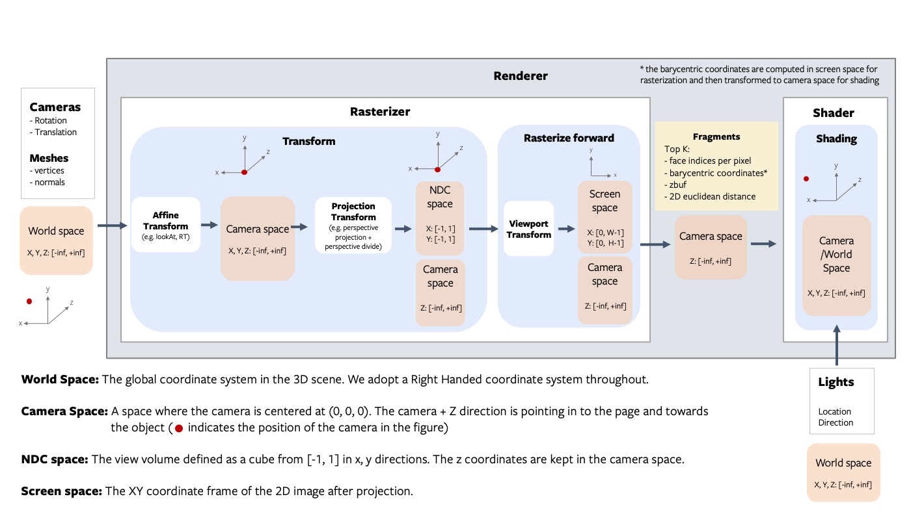
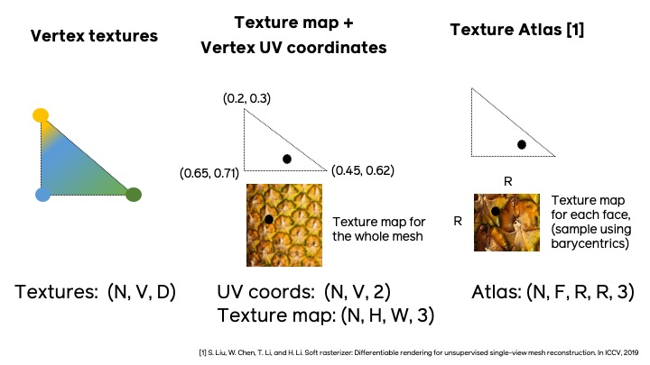

# Getting Started With Renderer

### Architecture Overview

The renderer is designed to be modular, extensible and support batching and gradients for all inputs. The following figure describes all the components of the rendering pipeline.


##### Fragments

The **rasterizer** returns 4 output tensors in a named tuple.

- **`pix_to_face`**: LongTensor of shape `(N, image_size, image_size, faces_per_pixel)` specifying the indices of the faces (in the packed faces) which overlap each pixel in the image.
- **`zbuf`**: FloatTensor of shape `(N, image_size, image_size, faces_per_pixel)` giving the z-coordinates of the nearest faces at each pixel in world coordinates, sorted in ascending z-order.
- **`bary_coords`**: FloatTensor of shape `(N, image_size, image_size, faces_per_pixel, 3)`
  giving the barycentric coordinates in NDC units of the nearest faces at each pixel, sorted in ascending z-order.
- **`pix_dists`**: FloatTensor of shape `(N, image_size, image_size, faces_per_pixel)` giving the signed Euclidean distance (in NDC units) in the x/y plane of each point closest to the pixel.


See the renderer API reference for more details about each component in the pipeline.

---

**NOTE:**

The differentiable renderer API is experimental and subject to change!.

---

### Coordinate transformation conventions

Rendering requires transformations between several different coordinate frames: world space, view/camera space, NDC space and screen space. At each step it is important to know where the camera is located, how the +X, +Y, +Z axes are aligned and the possible range of values. The following figure outlines the conventions used PyTorch3D.




For example, given a teapot mesh, the world coordinate frame, camera coordinate frame and image are shown in the figure below. Note that the world and camera coordinate frames have the +z direction pointing in to the page.


---

**NOTE: PyTorch3D vs OpenGL**

While we tried to emulate several aspects of OpenGL, there are differences in the coordinate frame conventions.
- The default world coordinate frame in PyTorch3D has +Z pointing in to the screen whereas in OpenGL, +Z is pointing out of the screen.  Both are right handed.
- The NDC coordinate system in PyTorch3D is **right-handed** compared with a **left-handed** NDC coordinate system in OpenGL (the projection matrix switches the handedness).


---

### Rasterizing Non Square Images

To rasterize an image where H != W, you can specify the `image_size` in the `RasterizationSettings` as a tuple of (H, W).

The aspect ratio needs special consideration. There are two aspect ratios to be aware of:
    - the aspect ratio of each pixel
    - the aspect ratio of the output image
In the cameras e.g. `FoVPerspectiveCameras`, the `aspect_ratio` argument can be used to set the pixel aspect ratio. In the rasterizer, we assume square pixels, but variable image aspect ratio (i.e rectangle images).

In most cases you will want to set the camera aspect ratio to 1.0 (i.e. square pixels) and only vary the `image_size` in the `RasterizationSettings`(i.e. the output image dimensions in pixels).

---

### The pulsar backend

Since v0.3, [pulsar](https://arxiv.org/abs/2004.07484) can be used as a backend for point-rendering. It has a focus on efficiency, which comes with pros and cons: it is highly optimized and all rendering stages are integrated in the CUDA kernels. This leads to significantly higher speed and better scaling behavior. We use it at Facebook Reality Labs to render and optimize scenes with millions of spheres in resolutions up to 4K. You can find a runtime comparison plot below (settings: `bin_size=None`, `points_per_pixel=5`, `image_size=1024`, `radius=1e-2`, `composite_params.radius=1e-4`; benchmarked on an RTX 2070 GPU).


Pulsar's processing steps are tightly integrated CUDA kernels and do not work with custom `rasterizer` and `compositor` components. We provide two ways to use Pulsar: (1) there is a unified interface to match the PyTorch3D calling convention seamlessly. This is, for example, illustrated in the [point cloud tutorial](https://github.com/facebookresearch/pytorch3d/blob/main/docs/tutorials/render_colored_points.ipynb). (2) There is a direct interface available to the pulsar backend, which exposes the full functionality of the backend (including opacity, which is not yet available in PyTorch3D). Examples showing its use as well as the matching PyTorch3D interface code are available in [this folder](https://github.com/facebookresearch/pytorch3d/tree/master/docs/examples).

---

### Texturing options

For mesh texturing we offer several options (in `pytorch3d/renderer/mesh/texturing.py`):

1. **Vertex Textures**: D dimensional textures for each vertex (for example an RGB color) which can be interpolated across the face. This can be represented as an `(N, V, D)` tensor. This is a fairly simple representation though and cannot model complex textures if the mesh faces are large.
2. **UV Textures**: vertex UV coordinates and **one** texture map for the whole mesh. For a point on a face with given barycentric coordinates, the face color can be computed by interpolating the vertex uv coordinates and then sampling from the texture map. This representation requires two tensors (UVs: `(N, V, 2), Texture map: `(N, H, W, 3)`), and is limited to only support one texture map per mesh.
3. **Face Textures**: In more complex cases such as ShapeNet meshes, there are multiple texture maps per mesh and some faces have texture while other do not. For these cases, a more flexible representation is a texture atlas, where each face is represented as an `(RxR)` texture map where R is the texture resolution. For a given point on the face, the texture value can be sampled from the per face texture map using the barycentric coordinates of the point. This representation requires one tensor of shape `(N, F, R, R, 3)`. This texturing method is inspired by the SoftRasterizer implementation. For more details refer to the [`make_material_atlas`](https://github.com/facebookresearch/pytorch3d/blob/main/pytorch3d/io/mtl_io.py#L123) and [`sample_textures`](https://github.com/facebookresearch/pytorch3d/blob/main/pytorch3d/renderer/mesh/textures.py#L452) functions. **NOTE:**: The `TexturesAtlas` texture sampling is only differentiable with respect to the texture atlas but not differentiable with respect to the barycentric coordinates.




---

### A simple renderer

A renderer in PyTorch3D is composed of a **rasterizer** and a **shader**. Create a renderer in a few simple steps:

```
# Imports
from pytorch3d.renderer import (
    FoVPerspectiveCameras, look_at_view_transform,
    RasterizationSettings, BlendParams,
    MeshRenderer, MeshRasterizer, HardPhongShader
)

# Initialize an OpenGL perspective camera.
R, T = look_at_view_transform(2.7, 10, 20)
cameras = FoVPerspectiveCameras(device=device, R=R, T=T)

# Define the settings for rasterization and shading. Here we set the output image to be of size
# 512x512. As we are rendering images for visualization purposes only we will set faces_per_pixel=1
# and blur_radius=0.0. Refer to rasterize_meshes.py for explanations of these parameters.
raster_settings = RasterizationSettings(
    image_size=512,
    blur_radius=0.0,
    faces_per_pixel=1,
)

# Create a Phong renderer by composing a rasterizer and a shader. Here we can use a predefined
# PhongShader, passing in the device on which to initialize the default parameters
renderer = MeshRenderer(
    rasterizer=MeshRasterizer(cameras=cameras, raster_settings=raster_settings),
    shader=HardPhongShader(device=device, cameras=cameras)
)
```

---

### A custom shader

Shaders are the most flexible part of the PyTorch3D rendering API. We have created some examples of shaders in `shaders.py` but this is a non exhaustive set.

A shader can incorporate several steps:
- **texturing** (e.g interpolation of vertex RGB colors or interpolation of vertex UV coordinates followed by sampling from a texture map (interpolation uses barycentric coordinates output from rasterization))
- **lighting/shading** (e.g. ambient, diffuse, specular lighting, Phong, Gouraud, Flat)
- **blending** (e.g. hard blending using only the closest face for each pixel, or soft blending using a weighted sum of the top K faces per pixel)

 We have examples of several combinations of these functions based on the texturing/shading/blending support we have currently. These are summarised in this table below. Many other combinations are possible and we plan to expand the options available for texturing, shading and blending.

|Example Shaders  | Vertex Textures| UV Textures | Textures Atlas | Flat Shading| Gouraud Shading| Phong Shading | Hard blending | Soft Blending |
| ------------- |:-------------:  | :--------------:| :--------------:| :--------------:| :--------------:| :--------------:|:--------------:|:--------------:|
| HardPhongShader |  ✔️ |✔️|✔️|||  ✔️ |  ✔️||
| SoftPhongShader |  ✔️ |✔️|✔️|||  ✔️ | | ✔️|
| HardGouraudShader |  ✔️ |✔️|✔️||  ✔️ ||  ✔️||
| SoftGouraudShader |  ✔️ |✔️|✔️||  ✔️ |||  ✔️|
| HardFlatShader |  ✔️ |✔️|✔️|  ✔️ |||  ✔️||
| SoftSilhouetteShader ||||||||  ✔️|
