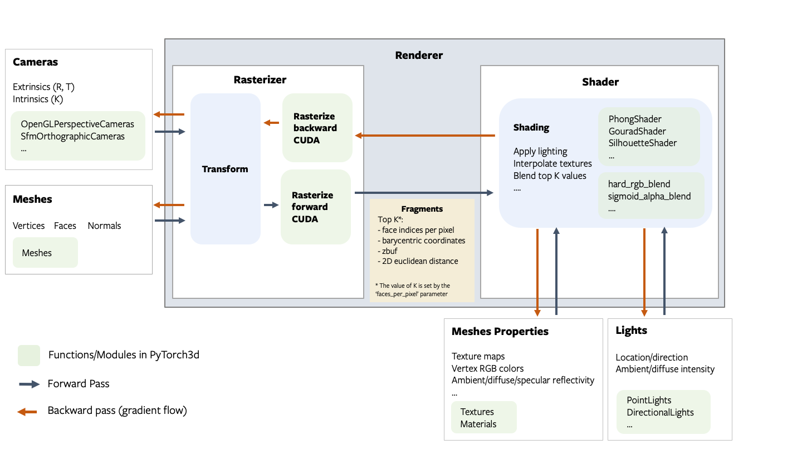
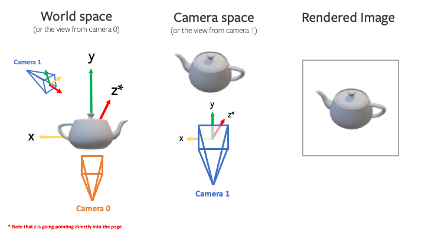

# Renderer Getting Started

### Architecture Overview

The renderer is designed to be modular, extensible and support batching and gradients for all inputs. The following figure describes all the components of the rendering pipeline.



##### Fragments

The **rasterizer** returns 4 output tensors in a named tuple.

- **`pix_to_face`**: LongTensor of shape `(N, image_size, image_size, faces_per_pixel)` specifying the indices of the faces (in the packed faces) which overlap each pixel in the image.
- **`zbuf`**: FloatTensor of shape `(N, image_size, image_size, faces_per_pixel)` giving the z-coordinates of the nearest faces at each pixel in world coordinates, sorted in ascending z-order.
- **`bary_coords`**: FloatTensor of shape `(N, image_size, image_size, faces_per_pixel, 3)`
  giving the barycentric coordinates in NDC units of the nearest faces at each pixel, sorted in ascending z-order.
- **`pix_dists`**: FloatTensor of shape `(N, image_size, image_size, faces_per_pixel)` giving the signed Euclidean distance (in NDC units) in the x/y plane of each point closest to the pixel.


See the renderer API reference for more details about each component in the pipeline.

---

**NOTE:**

The differentiable renderer API is experimental and subject to change!.

---

### Coordinate transformation conventions

Rendering requires transformations between several different coordinate frames: world space, view/camera space, NDC space and screen space. At each step it is important to know where the camera is located, how the +X, +Y, +Z axes are aligned and the possible range of values. The following figure outlines the conventions used PyTorch3D.


For example, given a teapot mesh, the world coordinate frame, camera coordiante frame and image are show in the figure below. Note that the world and camera coordinate frames have the +z direction pointing in to the page. 



---

**NOTE: PyTorch3D vs OpenGL**

While we tried to emulate several aspects of OpenGL, there are differences in the coordinate frame conventions. 
- The default world coordinate frame in PyTorch3D has +Z pointing in to the screen whereas in OpenGL, +Z is pointing out of the screen.  Both are right handed. 
- The NDC coordinate system in PyTorch3D is **right-handed** compared with a **left-handed** NDC coordinate system in OpenGL (the projection matrix switches the handedness).


---
### A simple renderer

A renderer in PyTorch3D is composed of a **rasterizer** and a **shader**. Create a renderer in a few simple steps:

```
# Imports
from pytorch3d.renderer import (
    OpenGLPerspectiveCameras, look_at_view_transform,
    RasterizationSettings, BlendParams,
    MeshRenderer, MeshRasterizer, HardPhongShader
)

# Initialize an OpenGL perspective camera.
R, T = look_at_view_transform(2.7, 10, 20)
cameras = OpenGLPerspectiveCameras(device=device, R=R, T=T)

# Define the settings for rasterization and shading. Here we set the output image to be of size
# 512x512. As we are rendering images for visualization purposes only we will set faces_per_pixel=1
# and blur_radius=0.0. Refer to rasterize_meshes.py for explanations of these parameters.
raster_settings = RasterizationSettings(
    image_size=512,
    blur_radius=0.0,
    faces_per_pixel=1,
    bin_size=0
)

# Create a phong renderer by composing a rasterizer and a shader. Here we can use a predefined
# PhongShader, passing in the device on which to initialize the default parameters
renderer = MeshRenderer(
    rasterizer=MeshRasterizer(cameras=cameras, raster_settings=raster_settings),
    shader=HardPhongShader(device=device, cameras=cameras)
)
```

### A custom shader

Shaders are the most flexible part of the PyTorch3D rendering API. We have created some examples of shaders in `shaders.py` but this is a non exhaustive set.

A shader can incorporate several steps:
- **texturing** (e.g interpolation of vertex RGB colors or interpolation of vertex UV coordinates followed by sampling from a texture map (interpolation uses barycentric coordinates output from rasterization))
- **lighting/shading** (e.g. ambient, diffuse, specular lighting, Phong, Gouraud, Flat)
- **blending** (e.g. hard blending using only the closest face for each pixel, or soft blending using a weighted sum of the top K faces per pixel)

 We have examples of several combinations of these functions based on the texturing/shading/blending support we have currently. These are summarised in this table below. Many other combinations are possible and we plan to expand the options available for texturing, shading and blending.


|Example Shaders  | Vertex Textures| Texture Map| Flat Shading| Gouraud Shading| Phong Shading | Hard blending | Soft Blending |
| ------------- |:-------------:  | :--------------:| :--------------:| :--------------:| :--------------:|:--------------:|:--------------:|
| HardPhongShader |  :heavy_check_mark: ||||  :heavy_check_mark: |  :heavy_check_mark:||
| SoftPhongShader |  :heavy_check_mark: ||||  :heavy_check_mark: | | :heavy_check_mark:|
| HardGouraudShader |  :heavy_check_mark: |||  :heavy_check_mark: ||  :heavy_check_mark:||
| SoftGouraudShader |  :heavy_check_mark: |||  :heavy_check_mark: |||  :heavy_check_mark:|
| TexturedSoftPhongShader ||  :heavy_check_mark: |||  :heavy_check_mark: ||  :heavy_check_mark:|
| HardFlatShader |  :heavy_check_mark: ||  :heavy_check_mark: |||  :heavy_check_mark:||
| SoftSilhouetteShader |||||||  :heavy_check_mark:|
